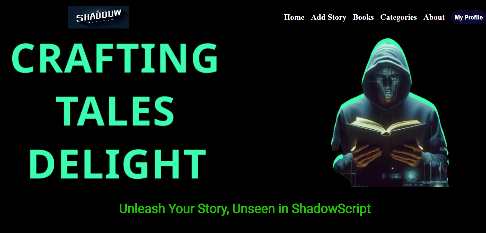
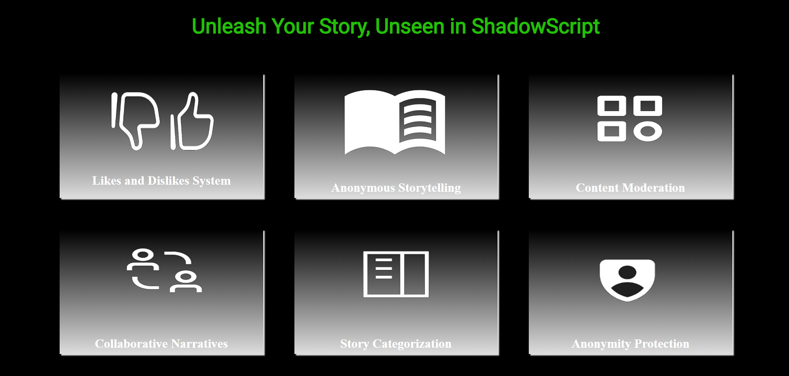
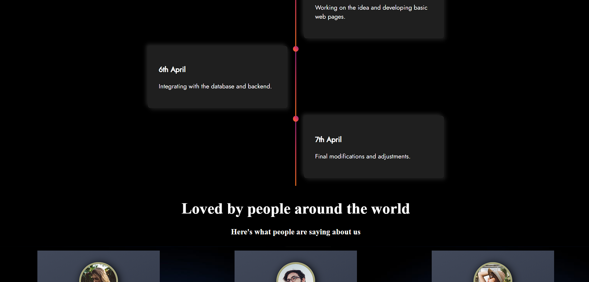
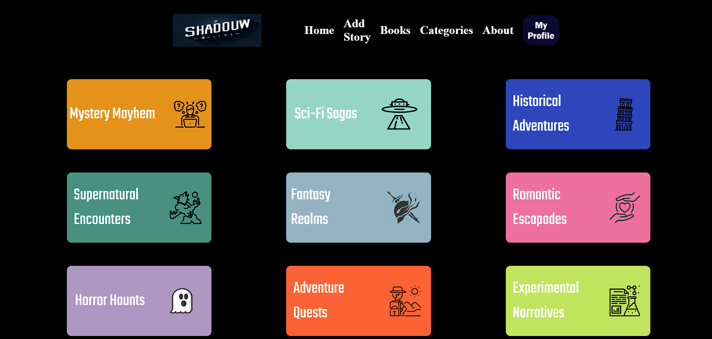
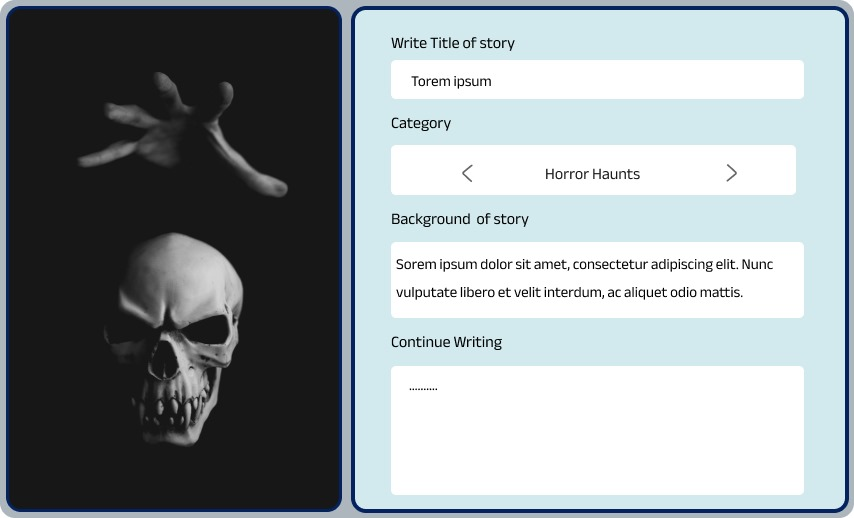

# ShadowScript

Welcome to ShadowScript - an anonymous storytelling platform where users can unleash their creativity in the shadows of anonymity.

[Link to PPT Presentation](https://www.canva.com/design/DAGBndS54jE/Hl9OBT9CgnEy2WwwgIA06A/edit?utm_content=DAGBndS54jE&utm_campaign=designshare&utm_medium=link2&utm_source=sharebutton)

## About

ShadowScript provides a platform for users to start a story and have other anonymous users continue it according to their own perspective. It fosters a community of storytellers who can contribute to collaborative narratives without revealing their identities.

## Features

- *Anonymous Storytelling*: Users can start stories anonymously and contribute to existing stories without revealing their identity.
- *Collaborative Narratives*: Multiple users can contribute to a single story, creating rich and diverse narratives.
- *Anonymity Protection*: User privacy is prioritized, and measures are taken to ensure that no personal information is revealed on the platform.
- *Story Categorization*: Stories can be categorized based on genres and themes, making it easy for users to discover content they're interested in.
- *Like and Dislike System*: Users can express their appreciation or disapproval of stories through the like and dislike feature.
- *Content Moderation*: A robust moderation system is in place to ensure that reported content is reviewed promptly and that the platform remains a safe and welcoming space for all users.

## Getting Started

To get started with ShadowScript, follow these steps:

1. Clone the repository: `git clone https://github.com/ShadowScriptRepo/ShadowScript.git`
2. Navigate to the project directory: `cd ShadowScript`
3. Install dependencies: `npm install`
4. Start the server: `node index.js`

Now you're ready to explore the stories shared by our anonymous community and contribute your own!

## Screenshots

Here are some screenshots of our website:

## Contributing

We welcome contributions from the community to help improve ShadowScript. If you have any ideas for new features, suggestions for improvements, or would like to report a bug, please don't hesitate to open an issue or submit a pull request on GitHub.